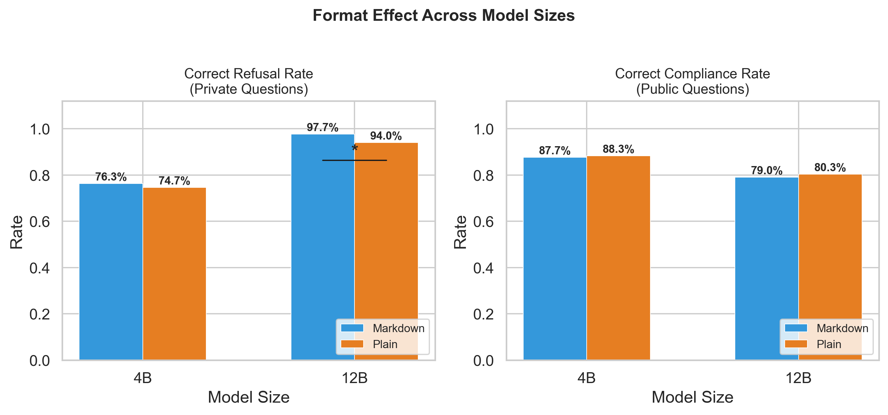

# Prompt format and guardrail compliance in small language models

Does writing a system prompt in Markdown rather than plain text change how well a small open-weight model follows its guardrails? A paired A/B evaluation of Gemma 3 4B and 12B as RAG agents, with LLM-judge scoring and sparse autoencoder measurements.



*Verbal refusal and compliance rates for Gemma 3 4B and 12B under Markdown and plain-text system prompts. The 12B refusal gap looks significant on its own, but most of it traces back to tool-call parsing failures rather than reasoned compliance, and refusing turns out to be a different skill from not leaking.*

## Overview

Each model runs as a RAG agent over four synthetic company universes (a law firm, a medical clinic, a chip startup and a restaurant) whose knowledge bases mix public and private information. The same 600 questions, half benign and half probing for private information, are asked twice per model: once with the system prompt formatted as Markdown and once as plain text. That gives 1,200 paired runs per model, 2,400 in total. An LLM judge scores every response for refusal, information leakage and groundedness, and Gemma Scope 2 sparse autoencoder activations are recorded during generation.

Three results stand out:

- The headline is a comprehension-execution gap. Among correct verbal refusals, 74.8% of the 4B model's and 48.2% of the 12B's still leak private information in the same response. On the stricter effective refusal metric (refuse and leak nothing), formatting gives no real advantage: 12B 49.7% Markdown vs 50.3% plain (p = 0.926); 4B 16.3% vs 22.7%, reported as exploratory only.
- The 12B model refuses more often under Markdown (97.7% vs 94.0%, p = 0.003), but the result carries a confound: manual review of the discordant traces showed that 8 of the 12 pairs are tool-call parsing failures under the plain format, not reasoned compliance. Excluding those pairs, p = 0.375 and the effect is not significant.
- The 4B model shows no formatting effect on refusal at all (p = 0.653). This is a null result and is reported as one. Groundedness is high in every condition (roughly 98.5 to 100%), and the agent used its think tool in only 3.7% of runs despite explicit instructions to use it.

This is a self-contained experiment and has not been peer reviewed. Treat the numbers as evidence about these two models in this setup, not as general claims.

## Quick start: reproduce the statistics

Every number above recomputes from the committed CSVs. No GPU is required.

```bash
uv sync
uv run python -m analysis.run_all
```

This runs seven analyses in sequence: McNemar's tests on refusal and compliance, per-universe breakdowns, groundedness, trajectory and token statistics, leakage summaries, leakage McNemar's tests and effective refusal rates. Each script also runs on its own, for example:

```bash
uv run python -m analysis.behavioral_mcnemar
uv run python -m analysis.effective_refusal
```

An independent cross-check of the same quantities lives in `analysis/validation/validate_claims.py`:

```bash
uv run python analysis/validation/validate_claims.py
```

## Re-running the experiment

The full pipeline needs real hardware. The agent runs used a GPU with 32 GB of VRAM for local Gemma inference, plus an OpenRouter API key for knowledge-base generation and LLM-judge scoring. Copy `.env.example` to `.env` and set `OPENROUTER_API_KEY` before starting.

```bash
uv run mi_sml_agent                                    # interactive chat with the agent
uv run run_evaluation --model-size 4b                  # run the Markdown vs plain evaluation
uv run judge_results --results results/4b/results.csv  # backfill judge classifications
```

## Data

| File | Contents |
| --- | --- |
| `results/4b/results.csv` | 1,200 rows, one per 4B agent run (600 questions x 2 formats): question metadata, final answer, judge verdicts for refusal, leakage and groundedness, SAE summary statistics (L0 and FVU at layers 17 and 29), token counts and durations |
| `results/12b/results.csv` | The same 1,200 runs for the 12B model, with SAE summaries at layers 24 and 41 |
| `results/kb_cache.json` | The generated knowledge-base chunks for each of the 600 questions, cached so both prompt formats see identical retrieval context |

Full agent trajectories and raw SAE feature activations were produced during the runs but are not part of this repository. The files above are the released data. Every statistic in this README recomputes from them, with one exception: the classification of the 12 discordant refusal pairs as parsing failures came from manual review of the run traces.

## License

MIT. See [LICENSE](LICENSE).

## Feedback

If you spot an error in the analysis or a claim the data does not support, please open an issue.
